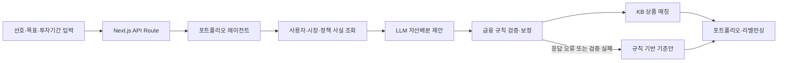

# KB 우리 아이 자산관리

부모가 자녀 명의의 KB국민은행 예·적금과 KB증권 투자자산을 함께 확인하고, 투자기간과 선호에 맞는 장기 포트폴리오를 제안받는 자녀 자산관리 서비스입니다.

KB스타뱅킹 내부의 자녀 자산관리 메뉴를 가정해 구현했습니다. 현재는 고정된 샘플 자녀와 자산 데이터를 사용하며, 프로토타입에서는 실제 계좌 조회·상품 가입·거래는 지원하지 않습니다.

## 해결하려는 문제

자녀 금융관리는 입출금통장 개설이나 단일 상품 가입에서 끝나기 쉽습니다. 예·적금과 투자자산이 나뉘어 있으면 전체 자산이 목표에 맞게 구성됐는지 판단하기도 어렵습니다.

이 서비스는 현재 자산, 목표금액, 남은 투자기간과 월 저축액을 한 화면에서 연결합니다. 보호자가 정한 자산·투자방식 선호를 반영해 목표 비중을 제안하고, 그 결과를 가입 가능한 KB국민은행 및 KB증권 상품 후보와 연결합니다.

## 주요 기능

- 자녀의 예·적금과 투자자산을 자산군별로 통합 표시
- `적금·예금·주식·채권`, `ETF·개별종목·미국·국내` 선호 순위 설정
- LLM이 사용자 조건과 기준일이 있는 시장 자료를 분석해 목표 비중과 근거 제안
- 금융 규칙 엔진이 투자기간, 상품 적합성, 세금과 비용을 검증·재계산
- 현재·추천 포트폴리오 비교와 신규 입금액·만기자금 중심의 리밸런싱 제안

## 이용 흐름

1. 보호자가 자녀의 현재 자산과 목표를 확인합니다.
2. 자산 및 투자방식 선호 순위를 정하고 투자기간과 월 저축액을 입력합니다.
3. 포트폴리오 에이전트가 사용자 조건과 시장 스냅샷을 분석합니다.
4. 금융 규칙 엔진이 제안 비중을 검증하고 필요한 부분을 보정합니다.
5. 검증된 비중에 적합한 KB국민은행·KB증권 상품을 연결합니다.
6. 현재 포트폴리오와 추천안을 비교하고 리밸런싱 방법을 확인합니다.

## LLM 포트폴리오 추천 구조



`PortfolioAdvisorAgent`는 서버에 등록된 읽기 전용 도구로 사용자 조건, 시장 자료, 정책 한도와 상품 후보를 조회합니다. LLM은 이 사실을 바탕으로 8개 자산군의 목표 비중과 추천 이유를 작성합니다. 상품 가입이나 거래를 실행하는 도구는 제공하지 않습니다.

### LLM이 담당하는 일

- 선호 순위, 목표금액과 투자기간 해석
- 기준일이 있는 시장·뉴스 요약에서 주요 변수 정리
- 기준 포트폴리오 범위 안에서 자산군 비중 제안
- 추천 이유와 불확실성 설명

### 금융 규칙 엔진이 담당하는 일

- 비중 합계와 투자기간별 ETF·주식 한도 검증
- 미성년자 가입 가능 여부, 판매 상태와 정보 유효기간 확인
- 예·적금 중도해지 손실과 만기 유지 조건 판단
- 증여세, 투자세금, 수수료와 환전비용 계산
- 검증된 자산군에 KB국민은행·KB증권 상품 매칭

LLM이 만든 금액·세금·수수료 값은 사용하지 않습니다. 모든 계산은 서버의 규칙 엔진이 다시 수행하며, 응답 형식이 잘못됐거나 정책을 통과하지 못하면 규칙 기반 기준안으로 전환합니다.

## 데이터와 구현 범위

시장·뉴스 데이터는 실시간 수집 결과가 아닙니다. `data/market_snapshot.json`에 기준일과 출처가 있는 샘플 스냅샷을 저장하며, 오래됐거나 출처가 불분명한 자료는 추천 근거에서 제외합니다. 상품 조건과 세금·수수료 정책도 CSV·YAML 파일에서 읽어 코드 수정 없이 교체할 수 있게 구성했습니다.

| 구분 | 현재 구현 |
| --- | --- |
| 자녀·계좌 | 고정 샘플 시나리오 |
| 시장·뉴스 | 기준일이 있는 로컬 스냅샷 |
| 상품·정책 | KB 상품 샘플 카탈로그와 데이터 기반 규칙 |
| LLM 분석 | 서버 API 호출, 미설정·실패 시 규칙 기반 전환 |
| 가입·거래 | 실제 주문 없이 Mock 이동 안내 |
| 사용자 설정 | 브라우저 `localStorage` 저장 |

## 기술 구성

- Frontend: Next.js, React, TypeScript
- Backend: Next.js API Route, Node.js
- AI: LLM API, 도구형 포트폴리오 에이전트
- Policy: CSV·YAML 기반 금융 규칙 엔진
- Test: Node.js Test Runner, ESLint

```text
app/        대시보드 UI와 포트폴리오 분석 API
lib/        포트폴리오 에이전트, 추천 엔진, 금융 규칙
data/       상품 카탈로그, 시장 스냅샷, 세금·수수료 정책
tests/      정책 엔진, API와 화면 통합 테스트
```

## 로컬 실행

Node.js 22.13 이상이 필요합니다.

```bash
git clone https://github.com/byabbya/KB_child_wealth.git
cd KB_child_wealth
npm install
```

LLM 분석을 사용하려면 프로젝트 루트에 `.env.local`을 만들고 현재 연동 코드가 읽는 환경변수를 설정합니다.

```dotenv
GEMINI_API_KEY=your_api_key
GEMINI_MODEL=gemini-3.5-flash
```

API 키는 서버에서만 읽으며 Git 저장소에 포함하지 않습니다. 키가 없어도 애플리케이션은 실행되고 규칙 기반 추천을 표시합니다.

```bash
npm run dev
```

브라우저에서 [http://localhost:3000](http://localhost:3000)을 엽니다.

## 검증

```bash
npm run lint
npm test
```

테스트에서 선호 순위에 따른 자산배분, 투자기간 안전장치, KB 상품 필터, 증여세와 투자비용 계산, LLM 도구 호출, 정책 위반 보정과 연결 실패 시 전환을 확인합니다.

## 제한사항

- 실제 자녀 계좌 조회, 법정대리인 확인, 상품 가입, 주문 실행과 세무신고는 구현 범위에 포함하지 않습니다.
- 프로토타입에서의 상품·시장 데이터는 샘플 스냅샷이므로 실제 판매 상태, 금리와 거래 조건은 가입 전에 공식 자료로 다시 확인해야 합니다.
- 화면의 세금, 비용과 기대수익은 계산 구조를 확인하기 위한 추정치이며 금융자문·세무신고·투자판단용 확정값이 아닙니다.
