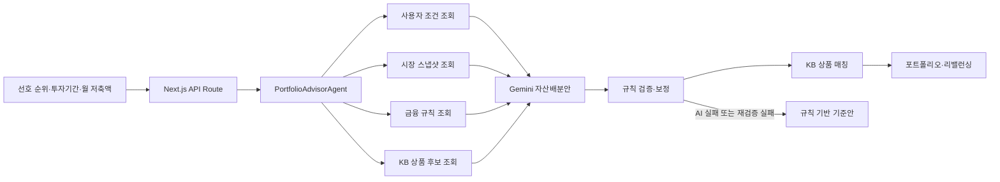

# KB 우리 아이 자산관리

자녀 명의의 KB국민은행 예·적금과 KB증권 투자자산을 한 화면에서 보고, 보호자가 정한 선호와 투자기간에 맞춰 다음 포트폴리오를 제안하는 자녀 자산관리 서비스입니다.

KB스타뱅킹 안의 자녀 자산관리 메뉴를 가정해 만들었습니다. 현재 버전은 실제 계좌 대신 고정된 자녀·보유자산 데이터를 사용합니다.

## 서비스 흐름

1. 자녀의 현재 자산과 목표금액을 확인합니다.
2. `적금·예금·주식·채권`의 선호 순위를 정합니다.
3. `ETF·개별종목·미국·국내`의 투자방식 선호 순위를 정합니다.
4. AI가 사용자 조건과 기준일이 있는 시장자료를 조회해 자산배분안을 작성합니다.
5. 규칙 엔진이 투자기간, 상품 가입조건, 세금과 비용을 검사합니다.
6. 검증된 비중에 KB국민은행·KB증권 상품을 연결합니다.
7. 현재 포트폴리오와 추천안을 비교하고 신규 입금·만기자금을 활용한 리밸런싱 순서를 보여줍니다.

## 화면에서 확인할 수 있는 것

- 현재 자산과 추천 자산배분을 비교하는 도넛 차트
- 자산군별 현재 비중, 추천 비중, 증감액과 실행 조치
- KB국민은행 예·적금·펀드와 KB증권 ETF·주식 추천 후보
- AI가 반영한 사용자 선호, 시장 판단과 추천 이유
- 신규 입금액과 만기자금을 먼저 쓰는 리밸런싱 제안
- 목표 변경 전후의 포트폴리오 차이
- 상품별 위험등급, 예금자보호 여부, 세금·수수료와 정보 기준일

## 추천이 만들어지는 방식



### AI가 맡는 부분

`PortfolioAdvisorAgent`는 Gemini 함수 호출을 이용해 서버에 등록된 읽기 전용 금융 도구를 선택합니다. 조회한 사실을 바탕으로 8개 자산군의 목표 비중과 추천 이유를 작성합니다.

- 사용자 선호와 목표 해석
- 국내·미국시장 스냅샷 요약
- 기준 포트폴리오 안에서 자산군 비중 조정
- 추천 이유와 불확실성 설명

### 규칙 엔진이 맡는 부분

금융 계산과 상품 적합성은 서버 코드가 처리합니다. 브라우저가 보낸 상품 ID나 정책값은 사용하지 않고 서버의 카탈로그와 규칙 파일을 다시 읽습니다.

- 비중 합계와 자산군별 조정 범위 검사
- 투자기간별 ETF·주식 및 개별주식 비중 제한
- 미성년자 가입·거래 가능 여부와 판매 상태 확인
- 예·적금 중도해지 손실과 만기 유지 조건 계산
- 증여재산공제, 투자세금, 수수료와 환전비용 계산
- KB국민은행과 KB증권의 공급자·거래채널 구분
- 검증된 비중에 가입 가능한 KB 상품 매칭

Gemini 응답이 규칙을 벗어나면 서버가 비중을 보정합니다. 응답 형식이 잘못됐거나 호출이 실패하면 규칙 기반 기준안으로 전환하고 화면에 실행 상태를 표시합니다.

## 데이터 기준

실시간 뉴스 수집이나 웹 크롤링은 하지 않습니다. `data/market_snapshot.json`에 기준일이 있는 시장지표, 뉴스 요약과 KB 리서치 형식의 샘플을 저장해 사용합니다.

시장지표는 7일, 뉴스·리서치 요약은 30일 동안 유효한 것으로 처리합니다. 출처나 날짜가 없거나 유효기간이 지나면 해당 시장 판단을 중립으로 바꾸고 추천 근거에서 제외합니다.

상품명, 금리, 한도와 가입조건도 코드에 고정하지 않습니다. CSV와 YAML 파일을 수정하면 추천 후보와 정책 평가가 함께 바뀝니다.

| 파일 | 용도 |
| --- | --- |
| `data/sample_scenario.json` | 자녀 기본정보, 현재 보유자산, 목표와 증여내역 |
| `data/kb_bank_products.csv` | KB국민은행 예·적금·펀드 후보 |
| `data/kb_securities_assets.csv` | KB증권에서 거래 가능한 ETF·주식 후보 |
| `data/kb_product_policies.yaml` | 연령, 가입한도, 판매 상태와 상품 정책 |
| `data/gift_tax_rules.yaml` | 증여재산공제와 증여세 계산 규칙 |
| `data/investment_tax_rules.yaml` | 금융상품별 과세 규칙 |
| `data/fee_assumptions.yaml` | 거래수수료, 환전비용과 상품보수 가정 |

## 구현 범위

| 항목 | 현재 구현 |
| --- | --- |
| AI 분석 | `GEMINI_API_KEY`가 있으면 Gemini 호출, 없거나 실패하면 규칙 기반 기준안 |
| 자녀·계좌 | 고정 샘플 시나리오 |
| KB 상품 | 기준일과 출처가 있는 샘플 카탈로그 |
| 시장·뉴스 | 기준일이 있는 로컬 스냅샷 |
| 세금·수수료 | 데이터 파일을 읽는 결정론적 계산 |
| 가입·거래 | 실제 주문 없이 Mock 이동 안내 |
| 사용자 상태 | 선호와 목표 변경값을 브라우저 저장소에 보관 |

## 기술 스택

- Frontend: Next.js, React, TypeScript
- Backend: Next.js API Route, Node.js
- AI: Google Gemini API (`gemini-3.5-flash`)
- Styling: Tailwind CSS, CSS
- Test: Node.js Test Runner
- Version control: Git, GitHub

## 로컬 실행

### 준비

- Node.js 22.13 이상
- npm
- Gemini API 키는 선택사항

```bash
git clone https://github.com/byabbya/KB_child_wealth.git
cd KB_child_wealth
npm install
```

프로젝트 루트에 `.env.local`을 만들고 다음 값을 입력합니다.

```dotenv
GEMINI_API_KEY=your_api_key
GEMINI_MODEL=gemini-3.5-flash
```

키는 서버에서만 읽으며 Git 저장소나 브라우저 응답에 포함하지 않습니다. 키를 넣지 않아도 규칙 기반 추천으로 전체 화면을 확인할 수 있습니다.

```bash
npm run dev
```

브라우저에서 [http://localhost:3000](http://localhost:3000)을 엽니다.

## 명령어

| 명령어 | 설명 |
| --- | --- |
| `npm run dev` | 개발 서버 실행 |
| `npm run build` | 프로덕션 빌드 |
| `npm run start` | 빌드된 앱 실행 |
| `npm run lint` | ESLint 검사 |
| `npm test` | 프로덕션 빌드 후 전체 테스트 실행 |

## 프로젝트 구조

```text
app/
  Dashboard.tsx                 대시보드 UI와 화면 상태
  api/portfolio-advice/route.ts AI 분석 API
data/                           상품·시장·세금·수수료 데이터
lib/
  portfolio-agent.mjs           Gemini 도구 호출과 정책 검증
  engine.mjs                    자산배분·상품 매칭·리밸런싱
  rules.mjs                     증여세·투자세금·KB 상품 정책
  providers.ts                  상품 카탈로그와 링크 Provider
tests/                          정책 엔진·에이전트·화면·API 테스트
```

## 테스트

현재 테스트는 다음 동작을 확인합니다.

- 선호 순위에 따른 결정론적 자산배분
- 투자기간별 성장자산 안전장치
- 미성년자 가입 불가·판매 중지·외부 상품 제외
- 증여재산공제, 투자세금과 비용 계산
- Gemini 함수 호출, 호출 한도와 시간 초과
- 잘못된 AI 비중의 거절·보정
- Gemini 장애 시 규칙 기반 전환
- 브라우저 입력을 신뢰하지 않는 서버 재검증
- 대시보드 렌더링과 포트폴리오 API

```bash
npm run lint
npm test
```

## 브랜치와 커밋 규칙

- 기능 추가 브랜치는 `feat#번호` 형식을 사용합니다.
- 구조 개선과 문서 정리는 `refactor#번호` 형식을 사용합니다.
- 커밋 메시지 마지막에는 현재 브랜치 이름을 붙입니다.

예: `Rewrite project README refactor#4`

## 제한사항

이 저장소는 서비스 시연을 위한 샘플 데이터와 Mock 이동을 포함합니다. 실제 계좌 조회, 법정대리인 확인, 상품 가입, 주식 주문과 세무신고 기능은 구현하지 않았습니다.

화면의 세금, 비용과 기대수익은 계산 구조를 보여주기 위한 추정치입니다. 금융자문, 세무신고 또는 투자판단의 확정값으로 사용할 수 없습니다.
