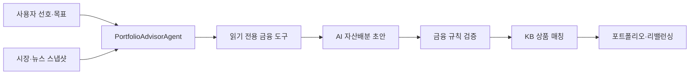

# KB 우리 아이 자산관리

부모가 자녀 명의의 KB국민은행 예·적금과 KB증권 투자자산을 함께 확인하고, 투자기간과 선호에 맞는 장기 포트폴리오를 제안받는 자녀 자산관리 서비스입니다.

[서비스 데모 보기](https://kb-child-wealth-2026.vbibbi507.chatgpt.site)

## 왜 만들었나

자녀 금융서비스는 계좌 개설이나 단일 상품 가입에서 끝나는 경우가 많습니다. 이 프로젝트는 이미 보유한 예·적금과 투자자산을 하나의 목표 아래에서 관리하는 흐름에 집중했습니다.

사용자는 자산 선호 순위와 투자방식 선호 순위를 정합니다. 서비스는 현재 자산, 목표금액, 남은 투자기간, 신규 저축액을 함께 보고 포트폴리오를 계산합니다. 추천 상품은 KB국민은행과 KB증권에서 가입하거나 거래할 수 있는 후보만 사용합니다.

## 주요 기능

- 자녀의 KB국민은행·KB증권 보유자산 통합 보기
- `적금·예금·주식·채권` 선호 순위 설정
- `ETF·개별종목·미국·국내` 투자방식 선호 순위 설정
- 현재 포트폴리오와 추천 포트폴리오 비교
- 자산군별 추천 상품, 금액, 위험등급과 조치 확인
- 신규 입금액과 만기자금을 우선 활용하는 리밸런싱 제안
- 최근 10년 증여내역을 반영한 증여재산공제·예상세액 계산
- Gemini 장애 시 규칙 기반 포트폴리오로 자동 전환

## 추천 구조



`PortfolioAdvisorAgent`는 Gemini 함수 호출을 이용해 사용자, 시장, 정책과 상품 정보를 조회합니다. AI는 8개 자산군의 비중과 추천 이유를 작성합니다.

금융 계산은 AI에 맡기지 않습니다. 규칙 엔진이 다음 항목을 다시 계산하고 검증합니다.

- 투자기간별 ETF·주식 비중 상한
- 기준 포트폴리오 대비 자산군별 조정 범위
- 미성년자 가입 및 거래 가능 여부
- 판매 상태, 상품정보 기준일과 출처
- 예·적금 중도해지 손실과 만기 유지 조건
- 증여세, 투자세금, 수수료와 환전비용
- KB국민은행과 KB증권의 공급자·거래채널 구분

검증을 통과하지 못한 AI 결과는 안전한 범위로 보정합니다. 보정할 수 없거나 Gemini 호출이 실패하면 규칙 기반 기준안을 표시합니다.

## 시장·뉴스 데이터

현재 버전은 실시간 뉴스 수집이나 웹 크롤링을 하지 않습니다. `data/market_snapshot.json`에 기준일이 있는 시장지표, 뉴스 요약과 KB 리서치 형식의 샘플을 저장해 사용합니다.

시장지표는 7일, 뉴스·리서치 요약은 30일을 유효기간으로 봅니다. 자료가 오래됐거나 출처·날짜가 없으면 시장 전망을 중립으로 처리하고 해당 근거를 추천에 사용하지 않습니다. 실제 서비스에서는 승인된 시장데이터와 KB 리서치 공급자를 같은 인터페이스에 연결하는 방식을 가정합니다.

## 기술 스택

- Frontend: Next.js, React, TypeScript
- Backend: Next.js API Route, Node.js
- AI: Google Gemini API (`gemini-3.5-flash`)
- Deployment: Vinext, Cloudflare Workers, Sites
- Version control: Git, GitHub

## 로컬 실행

Node.js 22.13 이상이 필요합니다.

```bash
npm install
```

프로젝트 루트에 `.env.local`을 만들고 Gemini API 키를 입력합니다.

```dotenv
GEMINI_API_KEY=your_api_key
GEMINI_MODEL=gemini-3.5-flash
```

API 키는 서버에서만 읽으며 브라우저 응답, 로그와 Git 저장소에 포함하지 않습니다. 키가 없어도 앱은 실행되며 AI 분석 대신 규칙 기반 추천을 표시합니다.

```bash
npm run dev
```

## 검증

```bash
npm run lint
npm test
```

테스트는 선호 순위와 투자기간 안전장치, KB 상품 필터, 증여세, 투자세금·수수료, Gemini 도구 호출, 정책 검증, 장애 대체 동작과 서버 입력 재검증을 확인합니다.

## 주요 데이터

- `data/sample_scenario.json`: 자녀 기본정보, 현재 보유자산과 증여내역
- `data/kb_bank_products.csv`: KB국민은행 예·적금과 펀드 후보
- `data/kb_securities_assets.csv`: KB증권에서 거래 가능한 ETF·주식 후보
- `data/kb_product_policies.yaml`: 자녀 상품 가입조건과 상품 정책
- `data/gift_tax_rules.yaml`: 증여재산공제와 증여세 계산 규칙
- `data/investment_tax_rules.yaml`: 금융상품별 과세 규칙
- `data/fee_assumptions.yaml`: 수수료, 환전비용과 상품보수 가정

## 범위와 제한

이 프로젝트는 공모전용 서비스 시연본입니다. 고정된 자녀 시나리오와 샘플 상품·시장 데이터를 사용하며 실제 계좌를 조회하지 않습니다. 상품 상세, 가입과 거래 버튼도 실제 주문 대신 Mock 이동 안내를 보여줍니다.

화면에 표시되는 세금과 수익은 구조를 설명하기 위한 추정치입니다. 금융자문, 세무신고 또는 투자판단용 확정값으로 사용할 수 없습니다.
